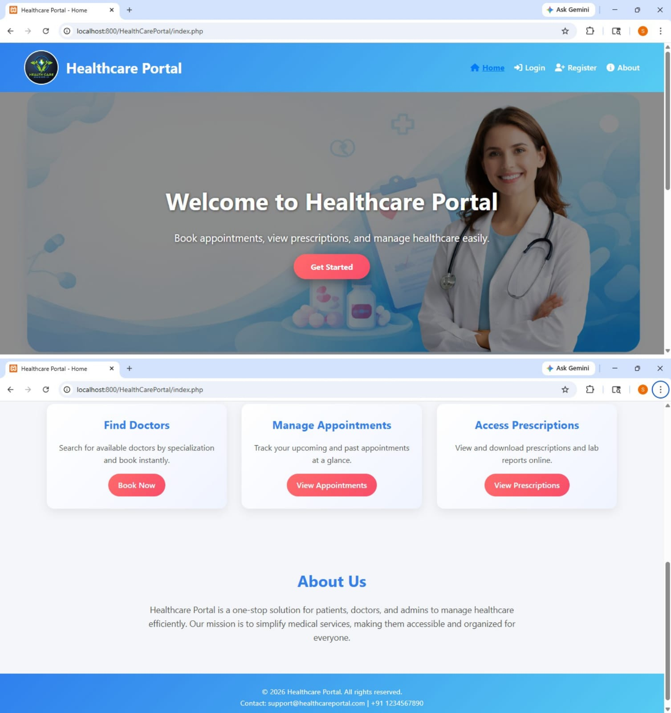
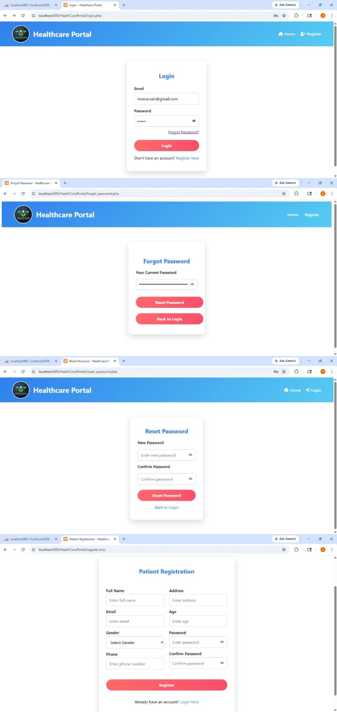
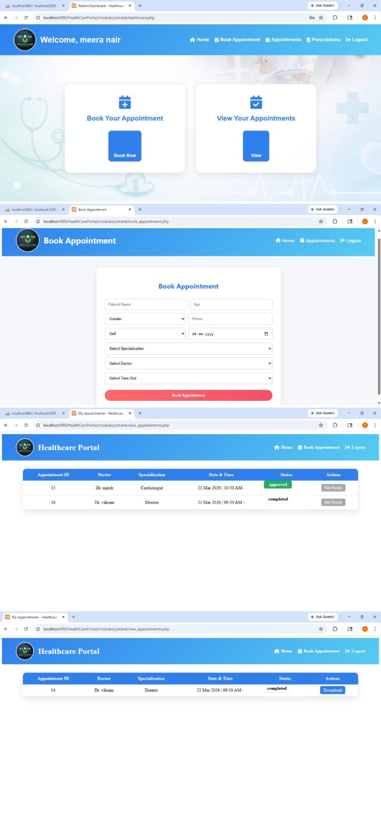
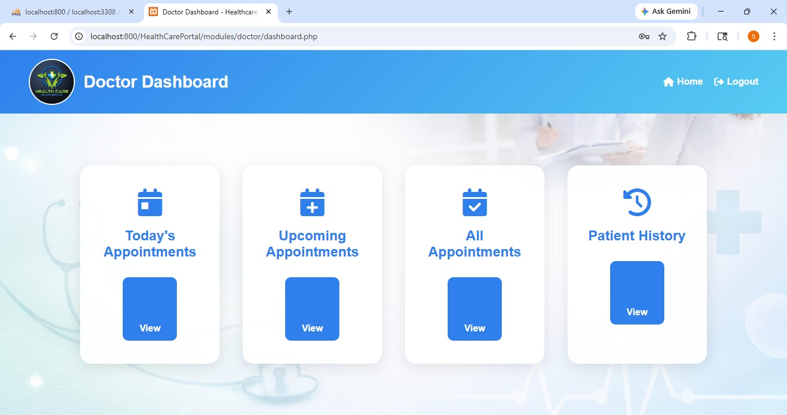
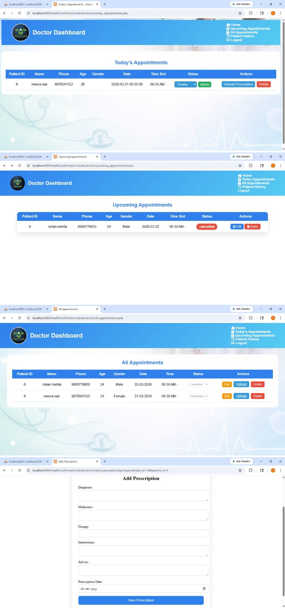
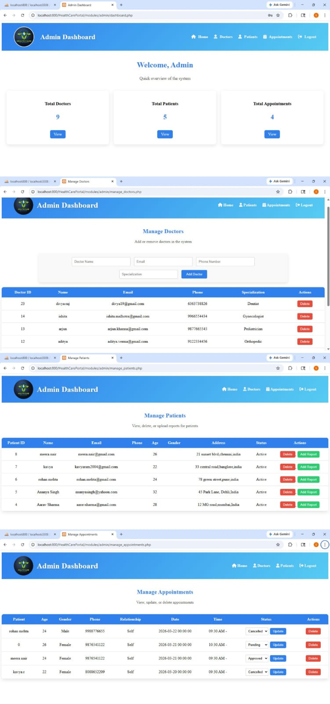
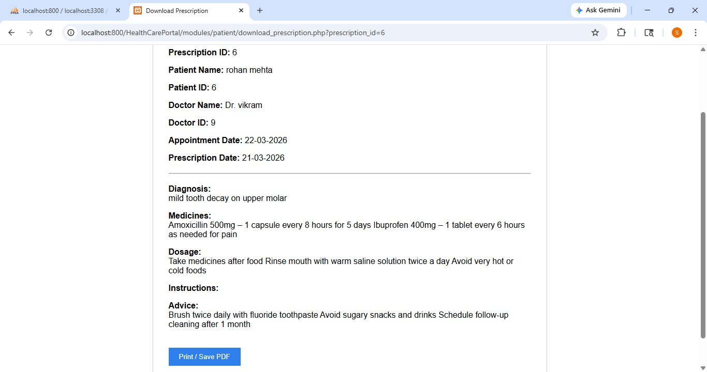

# HealthCare Portal

## Project Description
HealthCare Portal is a web-based application developed using PHP, MySQL, HTML, CSS, and JavaScript. 
This system allows patients to book appointments, doctors to manage appointments and upload prescriptions, and admin to manage doctors, patients, and reports.

## Modules
- Admin Module
- Doctor Module
- Patient Module

## Features
- User Registration and Login
- Book Appointment
- Appointment Status Tracking
- Doctor Upload Prescription
- Patient Download Prescription
- Admin Dashboard

## Technologies Used
- PHP
- MySQL
- HTML
- CSS
- JavaScript
- XAMPP

## Database
Import healthcare_portal.sql into MySQL before running the project.

## Author
Shilpa
## Project Screenshots

### Home Page

### Login Page

### Patient Dashboard

### Doctor Dashboard

### Doctor Dashboard 2

### Admin Dashboard

### Prescription

